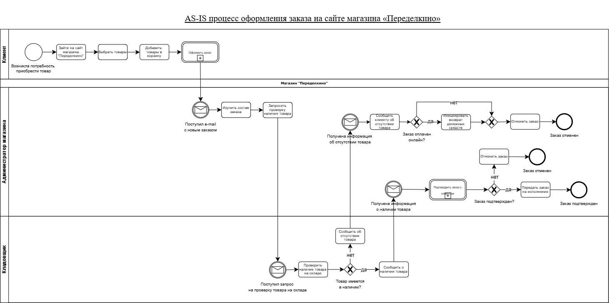
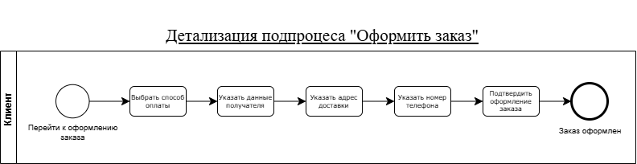
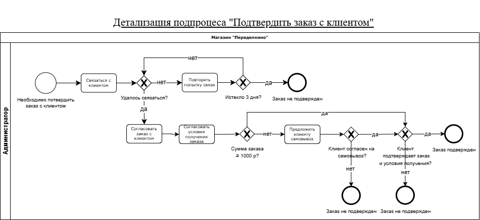
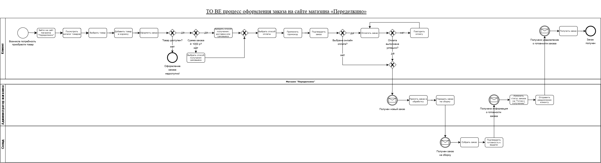
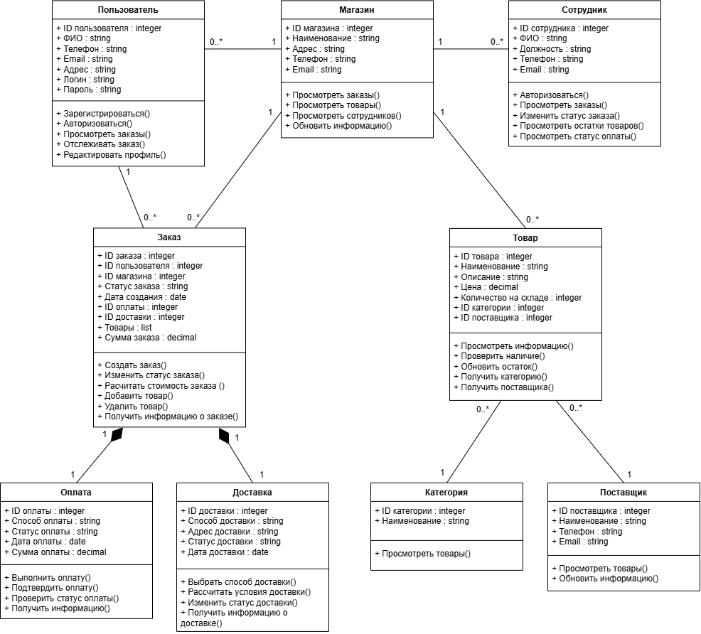
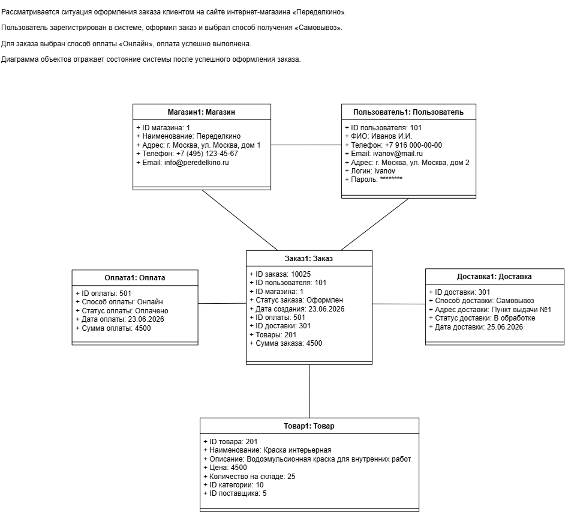

# 🏗 Автоматизация интернет-магазина строительных материалов

## О проекте

Проект выполнен в рамках практики по бизнес-анализу и демонстрирует полный цикл работы бизнес-аналитика — от обследования предметной области до подготовки проектной документации и проектирования будущего решения.

В качестве объекта исследования выбран интернет-магазин строительных материалов и товаров для дома **«Переделкино»**.

В ходе проекта были проанализированы существующие бизнес-процессы, выявлены проблемы текущей системы, сформированы требования к будущему решению, разработаны модели процессов, UML-диаграммы и прототип пользовательского интерфейса.

---

# 🎯 Цель проекта

Спроектировать решение, позволяющее автоматизировать процесс оформления и сопровождения заказов интернет-магазина, сократить количество ручных операций и повысить качество обслуживания клиентов.

---

# 📌 Бизнес-проблемы

В ходе обследования были выявлены основные проблемы существующей системы:

- отсутствует интеграция сайта со складской системой;
- обработка заказов выполняется вручную через электронную почту;
- отсутствует отображение актуальных остатков товаров;
- подтверждение заказа полностью зависит от телефонного звонка администратора;
- отсутствует возможность самостоятельного отслеживания статуса заказа;
- не поддерживается применение промокодов;
- отсутствует проверка корректности контактных данных;
- высокая нагрузка на сотрудников при обработке заказов.

---

# ✅ Предлагаемое решение

Для устранения выявленных проблем было спроектировано решение, предусматривающее:

- автоматизацию обработки заказов;
- отображение актуальных складских остатков;
- внедрение онлайн-оплаты;
- применение промокодов;
- автоматическое подтверждение заказов;
- возможность отслеживания статуса заказа;
- сокращение количества ручных операций;
- повышение качества клиентского сервиса.

---

# 🛠 Выполненные работы

В рамках проекта выполнены следующие задачи:

- обследование предметной области;
- анализ бизнес-процессов;
- моделирование процессов **AS IS** и **TO BE**;
- выявление проблем и точек роста;
- формирование бизнес-требований;
- разработка пользовательских требований;
- разработка функциональных требований;
- описание User Story;
- описание Use Case;
- построение UML-диаграмм;
- разработка прототипа интерфейса;
- подготовка критериев приемки.

---

# 📂 Артефакты проекта

| Артефакт | Описание |
|-----------|----------|
| 📄 [Отчет об обследовании](documents/Survey_Report.docx) | Анализ предметной области, описание текущего процесса, выявленные проблемы и точки роста |
| 📋 [Требования к решению](documents/Solution_Requirements.docx) | Бизнес-, пользовательские и функциональные требования, User Story, Use Case, критерии приемки |
| 📊 BPMN | Модели процессов AS IS и TO BE |
| 📈 UML | Диаграмма классов и диаграмма объектов |
| 🎨 [Прототип интерфейса](prototype/Prototype.pdf) | Прототип пользовательского интерфейса |

---

# 📊 BPMN

## AS IS

Текущий процесс оформления и обработки заказа.

---

## AS IS — Оформление заказа

Декомпозиция процесса оформления заказа.

---

## AS IS — Подтверждение заказа

Декомпозиция процесса подтверждения заказа.

---

## TO BE

Целевой бизнес-процесс после автоматизации.

---

# 📈 UML

## Диаграмма классов

---

## Диаграмма объектов

---

# 🎨 Прототип

Разработан прототип пользовательского интерфейса интернет-магазина.

📄 **[Открыть прототип](prototype/Prototype.pdf)**

---

# 🧰 Использованные инструменты

- BPMN
- UML
- Draw.io
- Miro
- Microsoft Word

---

# 💼 Продемонстрированные компетенции

В ходе выполнения проекта были продемонстрированы следующие навыки:

- обследование предметной области;
- анализ бизнес-процессов;
- выявление бизнес-проблем;
- формирование бизнес-требований;
- разработка пользовательских требований;
- моделирование процессов BPMN;
- моделирование UML;
- проектирование пользовательского интерфейса;
- подготовка проектной документации;
- разработка критериев приемки.

---

> **Статус проекта:** Завершен  
> **Роль:** Бизнес-аналитик  
> **Период выполнения:** 2026 год
